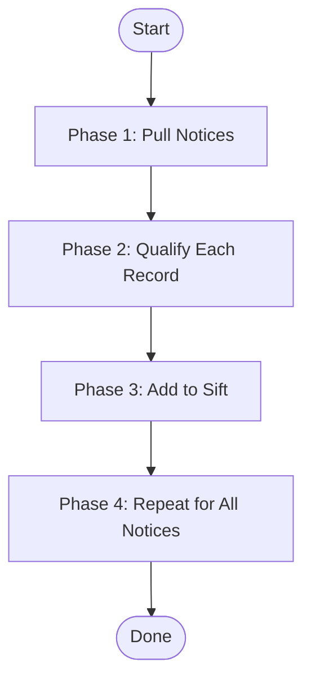
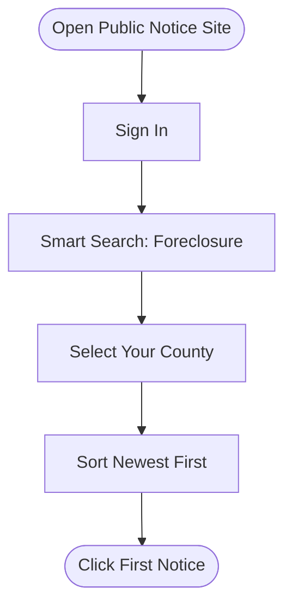
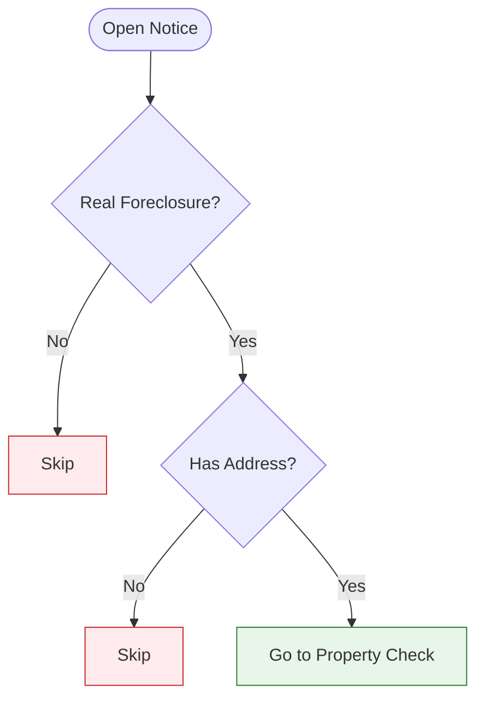
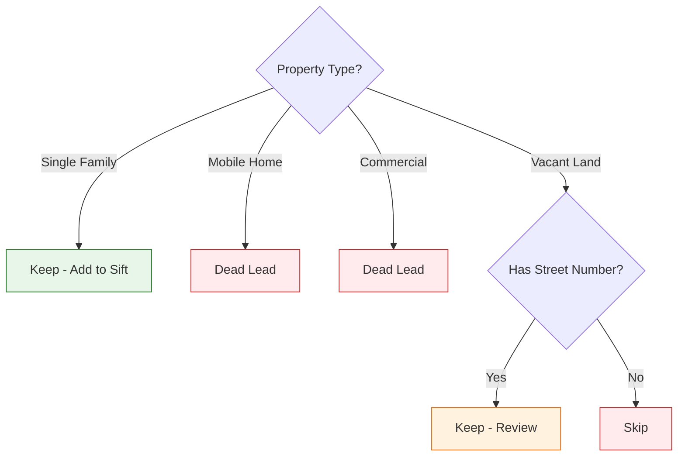
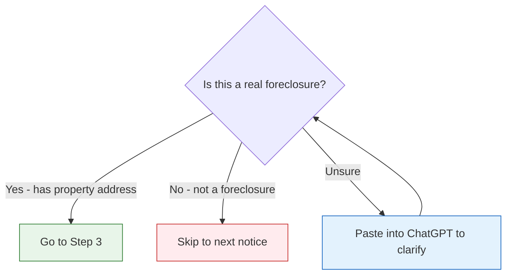

# Foreclosure Example: From Training Call to SOP

This reference shows how a real training call transcript was turned into a structured SOP. Use it as a model for how to extract workflows from transcripts and format them as playbooks or SOPs.

---

## The Source: What We Started With

A 40-minute training call where Ty (team lead) walked Marwan (new team member) through the daily process of pulling foreclosure notices from a public records site, qualifying each record, and adding good ones to Sift. The transcript was messy — full of tangents, troubleshooting, and back-and-forth — but the core process was clear.

---

## What We Extracted

From the transcript, we identified:
- **10 main steps** in the daily workflow
- **5 key decision points** where you keep or skip a record
- **3 tools used** (Public Notice site, Zillow, Sift)
- **7 pro tips** from the trainer's experience
- **1 complete walkthrough** of a real record

---

## The Finished SOP

Below is the SOP that was produced from that transcript. Notice how the messy, conversational training call became clean, scannable documentation with a process map, decision trees, and a worked example.

---

# How to Pull Foreclosure Records Daily

**SOP**

---

## Purpose & Overview

This process pulls fresh foreclosure notices from your county's public records site every day. You qualify each record, skip the junk, and add good ones to Sift so the team can market to them.

**Purpose:** Get first-to-market foreclosure leads into Sift every day.

**How:** Pull notices from public records, qualify each one, and upload the good ones.

---

## Process Map

Here's the workflow at a glance. The overview shows the major phases, then each phase has its own detail chart below.

### Overview: The 4 Phases

### Phase 1 Detail: Pull Notices

### Phase 2 Detail: Qualify Each Record

### Phase 2 Detail: Property Type Check

---

## What You Need

### Tools & Access

| Tool | What It's For | How to Get It |
|------|---------------|---------------|
| Public Notice Site (e.g., TM Public Notice) | Pulling foreclosure notices daily | Sign up at the site. Use Smart Search. |
| Zillow | Quick property lookup to check type and value | Free — just go to zillow.com |
| Sift | CRM where you store and manage leads | Your team admin gives you access |

### Setup

1. **Public Notice Account**: Sign in. You'll see a "Welcome" banner at the top. Go to Viewed Search Criteria.
2. **Sift Access**: Make sure you can create records and upload files.
3. **Zillow**: No setup needed. Just have it open in another tab.

---

## Steps

### Step 1: Open the Public Notice Site and Search Foreclosures

**Goal:** Pull today's batch of foreclosure notices for your county.

Go to the public notice site and sign in. Hit **Smart Search** at the top. Go to **Viewed Search Criteria** and select **Foreclosure**. Pick your county (for example, Knox County). Set it to pull the trailing year of data, sorted from newest to oldest.

**Actions:**
1. Sign in to the public notice site
2. Click **Smart Search** at the top
3. Select **Foreclosure** as the search type
4. Pick your county
5. Sort results **newest to oldest**
6. Set results per page to **50** (speeds things up)

> **SCREENSHOT: Public Notice Search Screen**
>
> *Capture: The Smart Search page with Foreclosure selected and county filter applied*
> *Purpose: Shows the reader exactly which filters to set*

> **Pro Tip:** Do this every day, ideally in the morning. You want to catch new notices as soon as they're posted. This is how you stay first to market.

---

### Step 2: Open Each Notice and Check If It's a Real Foreclosure

**Goal:** Filter out non-foreclosure notices that get mixed into the results.

Click on the first notice in the list. It'll open a detail view. Read through it quickly. A lot of the time, what looks like a foreclosure is actually something else — a property tax notice, a non-resident notice, or a government filing.

**Actions:**
1. Click on the first notice
2. Complete the captcha if one pops up
3. Read the notice quickly
4. Look for the word **"foreclosure"** or **"address"** or **"property"** in the text

**Decision Gate:**
- IF the notice mentions a property address and foreclosure → **Keep it. Go to Step 3.**
- IF it's not clearly a foreclosure (no property mentioned, just legal language) → **Skip it. Click back and go to the next notice.**
- IF you're unsure → **Copy the text into ChatGPT and ask: "Is this a foreclosure notice? What's the property address?"**

> **Pro Tip:** Anytime the notice is a "non-resident notice," it's almost never a real foreclosure. You can usually skip these. But double-check a few to be safe.

---

### Step 3: Look Up the Property on Zillow

**Goal:** Figure out what kind of property it is and if it's worth pursuing.

Take the property address from the notice and search it on Zillow. Hit the lightning bolt or just type it in. You're looking for three things: property type, approximate value, and whether it looks like a real house.

**Actions:**
1. Copy the property address from the notice
2. Open Zillow in another tab
3. Paste the address and search
4. Check the property type and estimated value

**Decision Gate:**
- IF it's a **single-family home under $600K** → **Keep it. Go to Step 4.**
- IF it's a **mobile home** → **Dead lead. Mark and skip.**
- IF it's **commercial** (car lot, strip mall, etc.) → **Dead lead. Mark and skip.**
- IF it's **vacant land with no street number** → **Skip — not worth it.**
- IF Zillow **can't find the address** → **The address might be slightly off. Try adjusting it. If still nothing, keep it and manually verify later.**

> **SCREENSHOT: Zillow Property Lookup**
>
> *Capture: A Zillow search result showing property type and estimated value*
> *Purpose: Shows what information to look for*

> **Pro Tip:** Anytime the assessed value shows something like $2,800, be skeptical. That's usually vacant land assessed at almost nothing, not a house. Check the map view to confirm.

---

### Step 4: Add the Property to Sift

**Goal:** Get this lead into your CRM so the team can market to it.

Go to Sift. Click **Records** and then **Add a New Property**. Sometimes Sift will auto-find the property when you start typing the address. If it does, great. If not, you'll need to add it manually.

**Actions:**
1. Go to Sift → Records → Add New Property
2. Type the property address
3. If Sift finds it → Click to add it
4. If Sift says "property already in records" → Skip it (someone already added it)
5. If Sift can't find it → Add manually using Ctrl+Shift+V to paste as plain text

> **SCREENSHOT: Sift Add Property Screen**
>
> *Capture: The Add New Property dialog in Sift*
> *Purpose: Shows where to type the address and what buttons to click*

> **Pro Tip:** If the manual add button doesn't work at first, make sure you hit it at the end of the address entry. It's a quirk of the system.

---

### Step 5: Fill in the Record Details

**Goal:** Make sure the record has all the info the team needs.

Once the property is added, fill in the key fields. The system will auto-enrich most of it, but you need to add the date and the source.

**Actions:**
1. Set the city and zip code (Sift auto-fills most of this)
2. Add the **Date Added** (today's date, format: MM/DD/YY)
3. Leave other fields blank — Sift will enrich them automatically
4. Add a note: "Foreclosure — [County Name] — pulled [date]"

---

### Step 6: Repeat for Every Notice

**Goal:** Work through the full list of new notices for the day.

Go back to the search results and click the next notice. Follow the same process: check if it's real, look up on Zillow, add to Sift if it qualifies. Keep going until you've gone through all the new notices since your last pull.

**Daily Cadence:**
- Do this every day
- Process all new notices since your last session
- Typical volume: 10-50 notices per county per day (many will be skips)
- Expected keepers: roughly 20-30% of total notices

---

## Worked Example: Walking Through a Real Record

**Starting point:** A new foreclosure notice for Knox County, Tennessee.

**Step 1 applied:** Opened the public notice site, searched Knox County foreclosures, sorted newest first. Found a notice posted today.

**Step 2 applied:** Clicked on the notice. Read through it. It mentions "foreclosure sale" and lists a property: "All Tassel Pike, Knoxville, Tennessee 37918." This is a real foreclosure with an address.

**Step 3 applied:** Searched "All Tassel Pike, Knoxville TN 37918" on Zillow. It's a single-family home. Estimated value: $185,000. Under the $600K cap. Looks like a normal house on a residential street.

**Decision:** Keep it. Single-family, reasonable value, has a real address.

**Step 4 applied:** Went to Sift → Records → Add New Property. Typed the address. Sift found a match and auto-populated the property details.

**Step 5 applied:** Added the date (10/13/25). Added a note: "Foreclosure — Knox County — pulled 10/13/25."

**End result:** The property is now in Sift as a foreclosure lead, tagged with the county and date. Ready for the team to skip trace and start marketing.

---

## Quality Check

### Checklist

1. [ ] Pulled all new notices since last session
2. [ ] Checked each notice to confirm it's a real foreclosure
3. [ ] Looked up each property on Zillow to verify type and value
4. [ ] Added all qualifying properties to Sift
5. [ ] Filled in date and source note for each record
6. [ ] Skipped mobile homes, commercial, and vacant land without addresses

### Common Problems

| Problem | Cause | Fix |
|---------|-------|-----|
| Notice isn't a foreclosure | Public records mix in other notice types | Read for the word "foreclosure" or "property address" |
| Zillow can't find the address | Address in the notice is slightly different | Try variations (street name without direction, nearby city names) |
| Sift says property already exists | Someone else already added it | Skip it — no need to duplicate |
| Captcha keeps popping up | The site throttles automated-looking behavior | Solve it and slow down a bit |

---

## Quick Reference

### Steps at a Glance

| Step | What to Do | What You Should See |
|------|------------|---------------------|
| 1 | Search foreclosures on public notice site | List of notices sorted newest first |
| 2 | Open each notice, check if it's real | Property address visible in the notice |
| 3 | Look up property on Zillow | Property type and value displayed |
| 4 | Add qualifying properties to Sift | Property appears in your records |
| 5 | Fill in date and source | Record has complete info |
| 6 | Repeat for all new notices | Empty inbox — all processed |

### Keep vs. Skip Quick Guide

| Property Type | Value | Action |
|--------------|-------|--------|
| Single-family home | Under $600K | **Keep** |
| Single-family home | Over $600K | **Review** — may not have wholesale buyers |
| Mobile home | Any | **Skip** — dead lead |
| Commercial | Any | **Skip** — dead lead |
| Vacant land | Has street number | **Review** — keep if value is over $50K |
| Vacant land | No street number | **Skip** |
| Any | Assessed at ~$2,800 | **Skip** — almost always vacant land |
