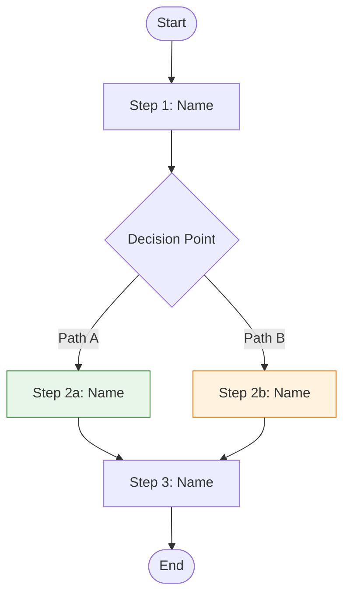

# Playbook Template

Use this template when creating playbooks. Change sections as needed for the topic. Write at a **5th-grade reading level** using short sentences and simple words. Use **Mermaid flowcharts** for process maps and decision trees. Use **UI screenshots** for software interfaces — no custom graphics or illustrations.

---

## Template Structure

```markdown
# [Playbook Title]

*[Motto or guiding idea]*

---

## Table of Contents

[Generate based on actual sections]

---

## [Concept Name]

[One paragraph saying what the concept is in plain words. What it is, what it does, why it matters.]

[Second paragraph with specific numbers or results that show the impact. Be concrete.]

> **Key Insight:** [One-sentence summary of the most important point]

---

## Process Overview

Here's the full workflow at a glance:



[One sentence connecting the diagram to the details below: "Here's how each step works."]

---

## [Framework/Process Name]

[Say what the framework is directly. Don't announce it—just explain it.]

[Example: "Closers work in two modes: Hunt Mode and Kill Mode. Hunt Mode is everything you do to get people on the phone. Kill Mode is everything you do on the phone to close the sale."]

> **SCREENSHOT: [Main Interface or Dashboard]**
>
> *Capture: [The main screen of the tool being used]*
> *Purpose: [Shows the reader where everything is before diving in]*

### Parts

| Part | What It Is | Why It Matters |
|------|------------|----------------|
| [Part 1] | [Simple description] | [What happens if you skip it] |
| [Part 2] | [Simple description] | [What happens if you skip it] |
| [Part 3] | [Simple description] | [What happens if you skip it] |

---

## [Process Section Title]

[Brief intro sentence if needed. Then break it down.]

### Step 1: [Step Name]

**Goal:** [What this step does in one sentence]

[Say what to do and why it matters. Include specific details: times, numbers, what to look for.]

**Actions:**
1. [First action with specific details]
2. [Second action]
3. [Third action]

> **SCREENSHOT: [Step 1 Screen]**
>
> *Capture: [The screen or button for this step]*
> *Purpose: [What the reader should see]*

### Step 2: [Step Name]

**Goal:** [What this step does]

[Explain what to do, why, and what to watch for.]

**Actions:**
1. [First action]
2. [Second action]

**Decision Gate:**
- IF [condition A] → [go to Step 3]
- IF [condition B] → [go back to Step 1 and adjust]

[For complex decisions with 3+ branches, add a Mermaid decision tree:]

```mermaid
flowchart TB
    A{[Decision Question]} -->|Condition A| B[Action A]
    A -->|Condition B| C[Action B]
    A -->|Condition C| D[Action C]

    style B fill:#e8f5e9,stroke:#2e7d32
    style C fill:#fff3e0,stroke:#ef6c00
    style D fill:#ffebee,stroke:#c62828
```

> **SCREENSHOT: [Step 2 Screen]**
>
> *Capture: [The screen or result for this step]*
> *Purpose: [What the reader should see]*

### Step 3: [Step Name]

[Continue pattern for remaining steps]

---

## Worked Example: [Scenario Name]

[Walk through one real scenario from start to finish, applying every step.]

**Starting point:** [What you begin with]

**Step 1 applied:** [What you do and what you see]
**Decision:** [What you decided and why]
**Step 2 applied:** [What you do next]
[...continue through all relevant steps...]

**End result:** [What the finished product looks like]

---

## Examples

### Example 1: [Scenario Name]

**Situation:** [Brief, realistic description]

**How to Apply:** [How the framework works in this case]

**Result:** [What to expect with specific numbers if possible]

### Example 2: [Scenario Name]

[Follow same pattern with a different scenario]

### Template: [Template Name]

```
[Give a fill-in-the-blank template the reader can use]
```

---

## Best Practices

### What Good Looks Like

1. **[Sign 1]**: [What this looks like in practice]
2. **[Sign 2]**: [Explanation]
3. **[Sign 3]**: [Explanation]

### What to Avoid

1. **[Problem 1]**: [What it looks like and what to do instead]
2. **[Problem 2]**: [Explanation and fix]
3. **[Problem 3]**: [Explanation and fix]

---

## Checklist

- [ ] [First step—specific and actionable]
- [ ] [Second step]
- [ ] [Third step]
- [ ] [Fourth step]
- [ ] [Fifth step]

---

## Quick Reference

### Key Numbers

| Metric | Target | How to Measure |
|--------|--------|----------------|
| [Metric 1] | [Target value] | [How to measure it] |
| [Metric 2] | [Target value] | [How to measure it] |

### Formulas

**[Formula Name]:**
```
[Formula] = [Part A] × [Part B]
```

### Decision Guide

| Situation | What to Do | What Happens |
|-----------|------------|--------------|
| [Situation] | [Action] | [Result] |
| [Situation] | [Action] | [Result] |

---

## Next Steps

1. [First next step—do this now]
2. [Second next step—do this week]
3. [Third next step—keep doing this]
```

---

## Section Guidelines

### Title Page
- Clear title that says what the playbook is about
- Include a motto or guiding idea
- Keep it clean

### Concept Section
- Say what the concept is in plain words
- Include specific numbers or results
- One key insight callout

### Process Overview (NEW)
- Mermaid flowchart showing the full workflow at a glance
- Place right after the concept section, before detailed steps
- Use color coding: green for success paths, red for dead ends, orange for "needs review"
- Keep it high-level — details come in the steps section
- One sentence after the diagram connecting it to the details

### Framework Section
- Say what the framework is directly—don't announce it
- Explain what each part is and why it matters
- Include a screenshot placeholder (UI only, no custom graphics)

### Process Steps
- Each step needs a goal
- Say what to do and why
- Include specific actions (numbered)
- Add decision gates where paths split
- For complex decisions (3+ branches), include a Mermaid decision tree
- Include screenshot placeholders for screens and buttons
- Add Pro Tip callouts for experienced insights

### Worked Example (NEW)
- Walk through ONE complete real scenario from start to finish
- Apply every step to the same record/case/scenario
- Show the decisions made and why
- This is often the most valuable section — don't skip it

### Examples Section
- Give 2-3 real examples (shorter than the worked example)
- Include at least one template
- Make examples realistic

### Best Practices Section
- Balance what good looks like and what to avoid
- Be specific
- Include fixes for problems

### Checklist
- Keep to 5-10 items
- Make items specific and actionable
- Put them in the right order
