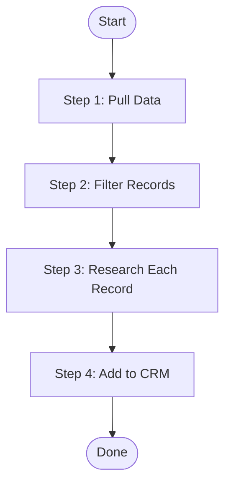
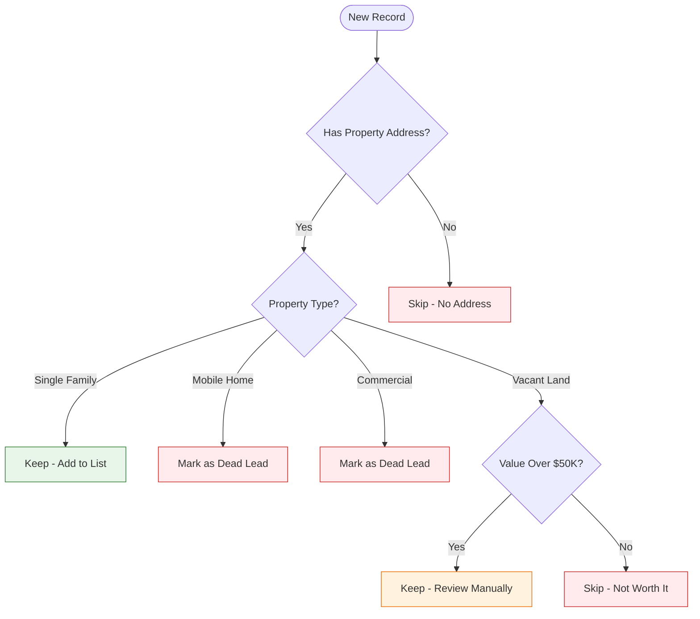
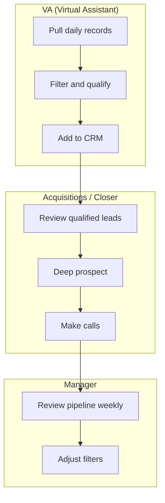
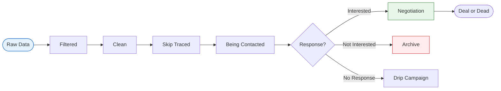
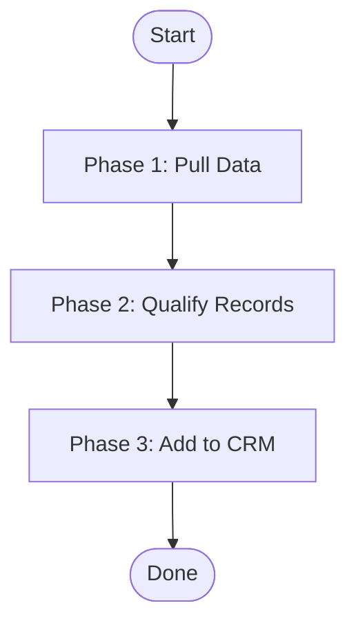
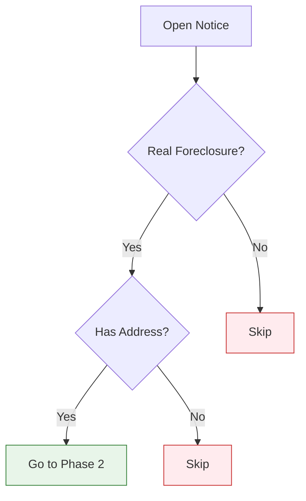

# Process Mapping Guide

Process maps turn complex workflows into visual diagrams that anyone can follow at a glance. This guide covers how to build them using Mermaid — a text-based diagramming tool that renders inside Markdown.

The goal of a process map is simple: show the reader the whole journey before they take the first step. Think of it like a trail map at a trailhead. You can see every turn, every fork, and where you'll end up — all before you start walking.

---

## Why Process Maps Matter

A wall of text describing a 12-step process with 4 decision points is hard to hold in your head. A flowchart showing the same thing takes 5 seconds to scan. Process maps help in three ways:

1. **Orientation** — the reader sees the full workflow before reading any details
2. **Decision clarity** — branching paths are obvious instead of buried in paragraphs
3. **Reference** — the reader can glance back at the map mid-process to see where they are

---

## Mermaid Basics

Mermaid diagrams live inside fenced code blocks with the `mermaid` language tag. They render automatically in most Markdown viewers (GitHub, Notion, Obsidian, etc.).

### Node Shapes

```
A[Rectangle]        -- Standard step / action
B{Diamond}          -- Decision point (yes/no, if/then)
C([Stadium])        -- Start or end point
D[(Database)]       -- Data source or storage
E((Circle))         -- Connector or reference point
```

### Arrow Types

```
A --> B             -- Standard flow
A -->|Yes| B        -- Labeled arrow
A -.-> B            -- Dotted arrow (optional path)
A ==> B             -- Thick arrow (emphasis)
```

### Styling

```
style A fill:#e8f5e9,stroke:#2e7d32    -- Green (success/go)
style B fill:#fff3e0,stroke:#ef6c00    -- Orange (decision/caution)
style C fill:#ffebee,stroke:#c62828    -- Red (stop/dead lead)
style D fill:#e3f2fd,stroke:#1565c0    -- Blue (info/tool)
```

---

## Flowchart Types

### 1. Linear Workflow Flowchart

Use for simple step-by-step processes. Direction: top-to-bottom (TB).



**When to use:** Processes with little or no branching. Good for overviews at the top of a document.

### 2. Decision Tree Flowchart

Use when a process has multiple branching paths based on conditions. This is the most common type for SOPs because real processes are full of "if this, then that" moments.



**When to use:** Any step where the reader has to make a choice. Especially useful when there are 3+ possible paths.

### 3. Swim Lane Diagram

Use when a process involves multiple people, roles, or tools. Each "lane" is a different person or system.



**When to use:** When the playbook or SOP covers a workflow that spans a team. Shows handoff points clearly.

### 4. Status Progression Diagram

Use to show how a record, lead, or item moves through stages over time.



**When to use:** Showing the lifecycle of a record through a system like Sift, a CRM, or a marketing funnel.

---

## Building a Process Map from a Transcript

When you're working from a transcript (like a training call), here's how to extract a process map:

### Step 1: Identify the Steps

Read through the transcript and write down every action the trainer takes, in order. Ignore the chit-chat. Focus on what they did.

Example from a foreclosure training call:
1. Go to public notice website
2. Search foreclosures for the county
3. Click on each notice
4. Determine if it's a real foreclosure
5. Check if there's a property address
6. Look up the property on Zillow
7. Decide if it's worth pursuing
8. Add the property to the CRM
9. Standardize the address
10. Move to the next record

### Step 2: Identify the Decision Points

Go back through and find every place the trainer said "if" or made a choice. These become diamonds in your flowchart.

Example decisions:
- "If it's not actually a foreclosure, skip it"
- "If there's no property address, skip it"
- "If it's a mobile home, mark it dead"
- "If it's commercial, mark it dead"
- "If the value is over $600K, probably skip it"

### Step 3: Build the Flowchart

Combine steps and decisions into a Mermaid diagram. Start with the overview (linear flow), then build out the decision tree for the most complex branching point.

### Step 4: Color-Code the Outcomes

Use consistent colors across all your diagrams:
- **Green** = Good outcome, keep going
- **Red** = Dead end, stop, skip
- **Orange** = Needs review, use judgment
- **Blue** = Information or tool reference

---

## Chart Size Limits (Critical)

**Large flowcharts render unreadable in Word documents.** A chart with 15+ nodes shrinks to fit the page and becomes too small to read. This is the #1 quality issue with process maps.

### The Rule: Max 7 Nodes Per Chart

No single Mermaid diagram should have more than **7 nodes** (including start/end nodes). If a process has more than 7 nodes, break it into segments.

### How to Break Up Large Workflows

Instead of one giant flowchart showing every step and decision, use this approach:

**1. High-Level Overview Chart (4-6 nodes)**
Shows the major phases of the process as a simple linear flow. Each node represents a phase, not an individual step.



**2. One Detail Chart Per Phase (5-7 nodes each)**
Each phase gets its own focused chart showing that phase's steps and decisions.



### How to Count Nodes

Count every shape in the diagram — rectangles, diamonds, stadiums, circles. If you're at 8 or more, split it.

| Node Count | Action |
|-----------|--------|
| 1-7 | Good — keep as one chart |
| 8-10 | Split into 2 charts |
| 11-15 | Split into 3 charts (overview + 2 detail) |
| 16+ | Split into overview + one chart per phase |

### Placement of Segmented Charts

Put the **overview chart** right after the Purpose section. Put each **detail chart** at the start of the step or phase it covers. This way the reader gets the map first, then sees each leg of the journey as they reach it.

### What NOT to Do

**Bad:** One flowchart with 18 nodes showing the entire process from start to finish with all decision branches. This renders at thumbnail size and nobody can read it.

**Good:** One 5-node overview showing the phases, then 3 separate 5-7 node charts showing the details of each phase. Each chart is large and readable.

---

## Formatting Rules for Mermaid in Playbooks/SOPs

1. **Keep charts under 7 nodes.** This is the most important rule. A chart with more than 7 nodes will be too small to read in the final document. Break large processes into segmented charts (overview + detail charts per phase).

2. **Use descriptive node labels.** Not just "Step 1" — say what the step actually does: "Pull Foreclosure Notices" or "Check Property Type."

3. **Label your arrows.** When paths branch, label the arrows with the condition: "Yes", "No", "Single Family", "Commercial", etc.

4. **Put the diagram before the details.** The whole point is to orient the reader. Put the overview diagram right after the intro. Put detail diagrams at the start of each step/phase.

5. **Reference the diagram in your text.** After the diagram, say something like: "Here's how each step works in detail." This connects the visual to the written instructions.

6. **Test that the Mermaid syntax renders.** Common issues: missing arrows, unclosed quotes, special characters in labels. Keep labels simple.

7. **Keep node text short.** Long labels make charts wider and harder to read. Max ~6 words per node label.

---

## Quick Reference: Mermaid Syntax

| Element | Syntax | Notes |
|---------|--------|-------|
| Flowchart direction | `flowchart TB` or `flowchart LR` | TB = top-to-bottom, LR = left-to-right |
| Rectangle node | `A[Label]` | Standard step |
| Diamond node | `A{Label}` | Decision point |
| Stadium node | `A([Label])` | Start / end |
| Arrow | `A --> B` | Basic connection |
| Labeled arrow | `A -->&#124;Label&#124; B` | Shows condition |
| Subgraph | `subgraph Name ... end` | Groups nodes (swim lanes) |
| Style | `style A fill:#color,stroke:#color` | Color individual nodes |

---

## Color Palette

Use these colors consistently across all diagrams in a document:

| Purpose | Fill Color | Stroke Color | When to Use |
|---------|-----------|-------------|-------------|
| Success / Keep | `#e8f5e9` | `#2e7d32` | Record passes, move forward |
| Stop / Dead | `#ffebee` | `#c62828` | Record fails, skip or dead lead |
| Caution / Review | `#fff3e0` | `#ef6c00` | Needs manual review or judgment |
| Info / Tool | `#e3f2fd` | `#1565c0` | References a tool or data source |
| Neutral / Default | No style needed | | Standard steps |
