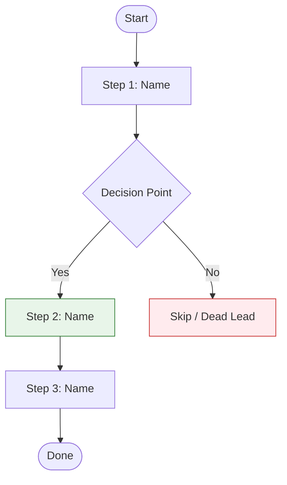

# SOP Template

Use this template when creating Standard Operating Procedures. Change sections as needed for the process. Write at a **5th-grade reading level** using short sentences and simple words. Use **Mermaid flowcharts** for process maps and decision trees. Use **UI screenshots** for software interfaces — no custom graphics or illustrations.

---

## Template Structure

```markdown
# [Process Name]

**SOP**

---

## Purpose & Overview

[One paragraph: what this process does and why it matters. Be specific about the result.]

**Purpose:** [One sentence—what are we trying to do?]

**How:** [One sentence—how are we going to do it?]

---

## Process Map

Here's the full workflow at a glance:



[One sentence: "Here's how each step works in detail."]

---

## What You Need

### Tools & Access

| Tool | What It's For | How to Get It |
|------|---------------|---------------|
| [Tool 1] | [Purpose] | [Link or steps] |
| [Tool 2] | [Purpose] | [Link or steps] |
| [Tool 3] | [Purpose] | [Link or steps] |

### Setup

1. **[Setting 1]**: [Steps]
2. **[Setting 2]**: [Steps]

> **SCREENSHOT: [Setup Screen]**
>
> *Capture: [The settings screen]*
> *Purpose: [Shows where to find the settings]*

---

## Steps

### Step 1: [Step Name]

**Goal:** [What this step does in one sentence]

[Say what to do and why. Include details: what to click, type, or pick.]

**Actions:**

1. [First action]
2. [Second action]
3. [Third action]

> **SCREENSHOT: [Step 1 Screen]**
>
> *Capture: [The button, menu, or screen to show]*
> *Purpose: [What the reader should see]*

> **Pro Tip:** [Practical insight from experience — something a trainer would mention]

---

### Step 2: [Step Name]

**Goal:** [What this step does]

[Say what to do and why.]

**Actions:**

1. [Action with details]
2. [Action with details]

**Decision Gate:**
- IF [condition A] → Go to Step 3
- IF [condition B] → Skip to Step 4
- IF [condition C] → Go back to Step 1 and [change]

[For complex decisions with 3+ branches, add a visual decision tree:]

```mermaid
flowchart TB
    A{[Decision Question]} -->|Condition A| B[Action A]
    A -->|Condition B| C[Action B]
    A -->|Condition C| D[Action C]

    style B fill:#e8f5e9,stroke:#2e7d32
    style C fill:#fff3e0,stroke:#ef6c00
    style D fill:#ffebee,stroke:#c62828
```

> **SCREENSHOT: [Step 2 Result]**
>
> *Capture: [The result screen]*
> *Purpose: [Shows the step worked]*

---

### Step 3: [Step Name]

**Goal:** [What this step does]

[Explain what to do]

**Actions:**

1. [Action]
2. [Action]
3. [Action]

**Check:** [How to know this worked]

> **SCREENSHOT: [Check Screen]**
>
> *Capture: [What success looks like]*
> *Purpose: [Reader can compare their result]*

---

### Step 4: [Step Name]

[Continue pattern for remaining steps]

---

## Worked Example: [Scenario Name]

[Walk through ONE complete real scenario applying every step above.]

**Starting point:** [What you begin with — e.g., "A new foreclosure notice from Knox County"]

**Step 1 applied:** [What you do and what you see]
**Decision:** [What you decided and why]
**Step 2 applied:** [What you do next]
[...continue through all relevant steps...]

**End result:** [What the finished product looks like]

---

## Decision Guide

### [Decision Point Name]

| Criteria | Threshold | What to Do |
|----------|-----------|------------|
| [Criteria 1] | [Value or condition] | [Action] |
| [Criteria 2] | [Value or condition] | [Action] |
| [Criteria 3] | [Value or condition] | [Action] |

### Formula

```
[Result] = ([Input A] ÷ [Input B]) × [Multiplier]
```

**Example:** [Worked example with real numbers]

---

## Quality Check

### Checklist

1. [ ] [First check]
2. [ ] [Second check]
3. [ ] [Third check]

### Common Problems

| Problem | Cause | Fix |
|---------|-------|-----|
| [Problem 1] | [Why it happens] | [How to fix] |
| [Problem 2] | [Why it happens] | [How to fix] |
| [Problem 3] | [Why it happens] | [How to fix] |

---

## Troubleshooting

### [Problem Type 1]

**Problem:** [What goes wrong]

**Fix:**
1. [First step]
2. [Second step]
3. [Third step]

### [Problem Type 2]

**Problem:** [What goes wrong]

**Fix:**
[Steps to fix]

---

## Advanced Uses

### [Use Case 1]

**When to Use:** [Specific situation]

**Steps:**
1. [Changed step]
2. [Changed step]

### [Use Case 2]

**When to Use:** [Specific situation]

**Steps:**
[Steps for this version]

---

## Best Practices

### What Good Looks Like

1. **[Sign 1]**: [What this looks like]
2. **[Sign 2]**: [What this looks like]
3. **[Sign 3]**: [What this looks like]

### What to Avoid

1. **[Problem 1]**: [What it looks like and what to do instead]
2. **[Problem 2]**: [Warning sign and fix]
3. **[Problem 3]**: [Warning sign and fix]

---

## Next Steps

1. [First action—do this now]
2. [Second action—do this week]
3. [Third action—keep doing this]

---

## Quick Reference

### Steps at a Glance

| Step | What to Do | What You Should See |
|------|------------|---------------------|
| 1 | [Brief action] | [Result] |
| 2 | [Brief action] | [Result] |
| 3 | [Brief action] | [Result] |
| 4 | [Brief action] | [Result] |

### Key Numbers

| Metric | Minimum | Target | Maximum |
|--------|---------|--------|---------|
| [Metric 1] | [Value] | [Value] | [Value] |
| [Metric 2] | [Value] | [Value] | [Value] |
```

---

## Section Guidelines

### Purpose & Overview
- Keep to 2-3 sentences
- Say the purpose and how plainly
- Focus on results

### Process Map (NEW)
- Mermaid flowchart showing all steps and decision points
- Place right after the overview, before the detailed steps
- Use color coding: green = keep/success, red = skip/dead, orange = review/caution
- Keep it focused — one diagram per major workflow
- Reference the diagram from the text ("Here's how each step works in detail")

### What You Need Section
- List all tools with how to get them
- Include setup steps
- Add screenshot for complex setup screens (UI only)

### Steps Section
- Each step needs a goal
- Say what to do and why
- Actions should be numbered and specific
- Include decision gates where paths split
- For complex decisions (3+ branches), add a Mermaid decision tree diagram
- Add checks for important steps
- Screenshot placeholders for screens and buttons (UI only)
- Pro Tip callouts for experienced insights

### Worked Example (NEW)
- Walk through ONE complete scenario from start to finish
- Apply every step to the same record/case
- Show the decisions made and why
- This is often the most valuable section for new team members

### Decision Guide Section
- Use tables for threshold-based decisions
- Include formulas with worked examples
- Make criteria measurable

### Quality Check Section
- Give a checklist
- List common problems with fixes

### Troubleshooting Section
- Group by problem type
- Give step-by-step fixes
- Include who to ask if stuck

### Advanced Uses
- Cover 2-3 advanced cases
- Say when to use each one
- Keep steps short

### Quick Reference
- Summarize key steps in a table
- Include key numbers
- Make it easy to scan
